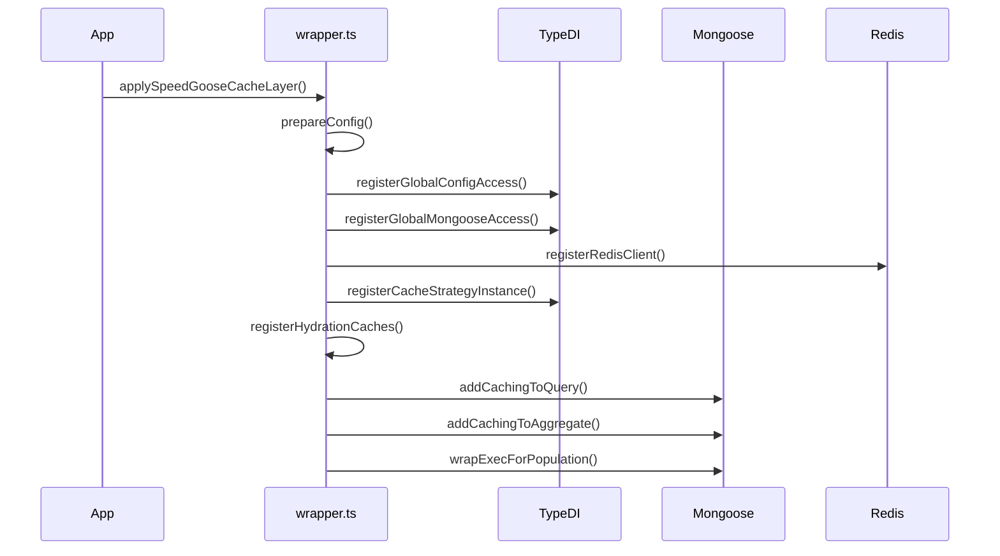
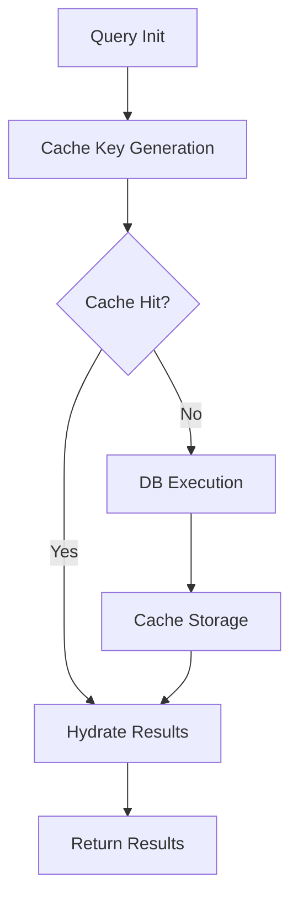
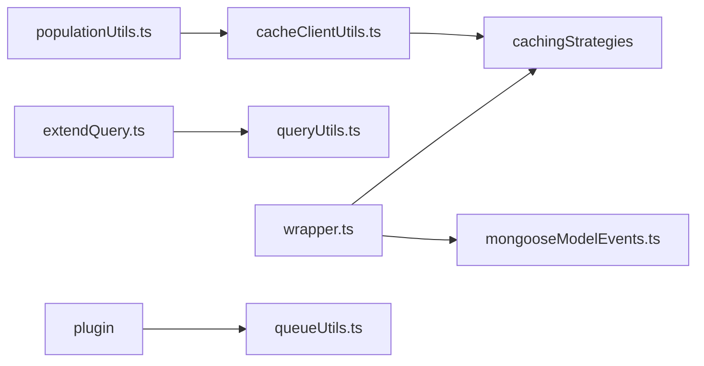

# SpeedGoose Architecture Deep Dive

## Component Responsibility Matrix

| Component | Source Files | Responsibilities |
|-----------|--------------|------------------|
| Core Initialization | [`src/wrapper.ts`](src/wrapper.ts:89-102) | Config setup, DI registrations, Mongoose method extensions |
| Caching Strategies | [`src/cachingStrategies/`](src/cachingStrategies/) | Implement storage-specific caching logic |
| Query Processing | [`src/extendQuery.ts`](src/extendQuery.ts), [`src/utils/queryUtils.ts`](src/utils/queryUtils.ts:70-86) | Query analysis, cache key generation, result hydration |
| Event Handling | [`src/mongooseModelEvents.ts`](src/mongooseModelEvents.ts:108-116) | Model change detection, cache invalidation |
| Population System | [`src/utils/populationUtils.ts`](src/utils/populationUtils.ts:75-100) | Reference resolution, batch document fetching |
| Plugin Framework | [`src/plugin/SpeedGooseCacheAutoCleaner.ts`](src/plugin/SpeedGooseCacheAutoCleaner.ts) | Background cache maintenance, TTL management |

## Initialization Sequence


## Query Execution Flow


## Known Stability Issues (from jest-results.json)
1. **Population Timeouts**  
   ```typescript
   // Failing test location
   test/features/cachePopulate.test.ts:15:5
   ```
   - Caused by document hydration delays in nested populations
   - Affects complex object graph resolutions

2. **Mock Setup Failures**  
   ```typescript
   test/utils/populationUtils.test.ts:28:53
   ```
   - Race conditions in cache strategy mocking
   - Impacts population dependency tracking

## Plugin System Architecture
```typescript
// Auto-cleaner implementation sketch
class SpeedGooseCacheAutoCleaner {
  constructor(
    @Inject(GlobalDiContainerRegistryNames.CACHE_CLIENT_GLOBAL_ACCESS)
    private readonly cacheClient: CommonCacheStrategyAbstract
  ) {
    this.setupCleanupInterval();
  }
  
  private setupCleanupInterval(): void {
    setInterval(() => this.clearExpiredEntries(), CLEANUP_INTERVAL);
  }
}
```

## Cross-File Dependency Map


## Recommended Improvements
1. Add circuit breaker pattern for cache storage operations
2. Implement batch hydration timeout thresholds
3. Add distributed lock mechanism for cache stampede prevention

[//]: # (Document generated at: 2025-07-20T20:04:54.770Z)