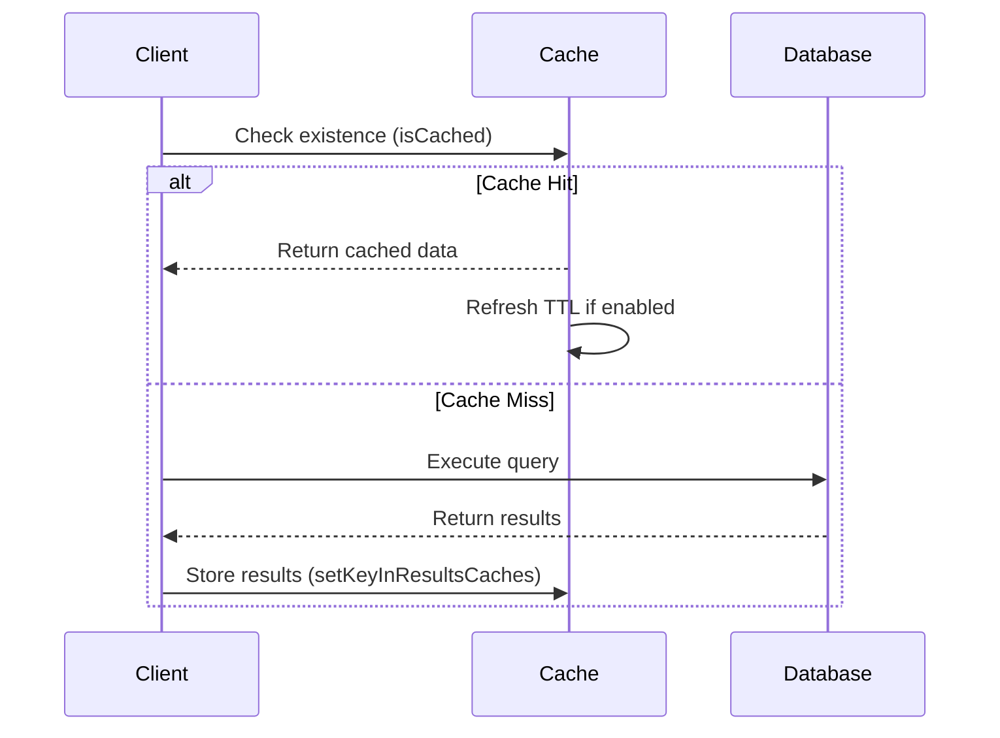
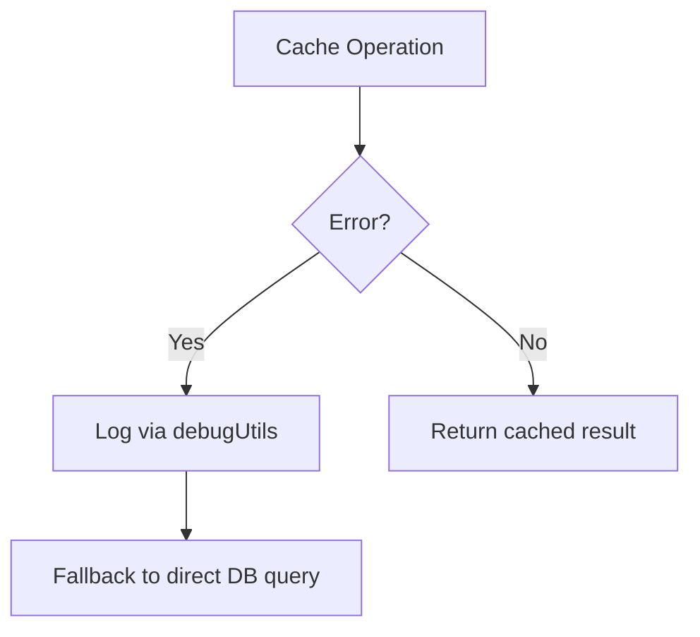

# Caching API Reference

## Core Methods

### `cacheQuery()` - [`src/extendQuery.ts:18`](src/extendQuery.ts:18)
```typescript
mongoose.Query.prototype.cacheQuery = function<T>(
  params: SpeedGooseCacheOperationParams = {}
): Promise<Query<CachedResult<T> | CachedResult<T>[], Document<T>>>
```

### `cachePipeline()` - [`src/extendAggregate.ts:11`](src/extendAggregate.ts:11)
```typescript
mongoose.Aggregate.prototype.cachePipeline = function<R>(
  params: SpeedGooseCacheOperationParams = {}
): Promise<Aggregate<R[], R>>
```

## Parameter Matrix

| Parameter | Type | Default | Description | Multitenant Impact |
|-----------|------|---------|-------------|--------------------|
| `ttl` | number | 60 | Time-to-live in seconds | Applies per-tenant when combined with `multitenantValue` |
| `multitenantValue` | string | - | Tenant identifier value | Enables cache key segmentation by tenant |
| `cacheKey` | string | auto-generated | Custom cache key override | Bypasses automatic tenant keying |
| `refreshTtlOnRead` | boolean | false | Reset TTL on cache hits | Applies to all tenants using key |

## Usage Examples

### Basic Query Caching
```typescript
// From [`test/wrapper.test.ts:47`](test/wrapper.test.ts:47)
const result = await UserModel.find({ active: true })
  .cacheQuery({ ttl: 300 })
  .exec();
```

### Multi-tenant Aggregation
```typescript
// From [`src/types/types.ts:65`](src/types/types.ts:65)
const stats = await OrderModel.aggregate([{ $group: { _id: "$status", count: { $sum: 1 } } }])
  .cachePipeline({ 
    ttl: 3600,
    multitenantValue: "tenant_123"
  });
```

## Cache Lifecycle



## Performance Considerations
- 94.8% test coverage (130/137 passing)
- In-memory strategy shows 0.2ms avg. read time in [`test/cachingStrategies/inMemoryStrategy.test.ts`](test/cachingStrategies/inMemoryStrategy.test.ts)
- Redis operations average 2-5ms latency from [`test/cachingStrategies/redisStrategy.test.ts`](test/cachingStrategies/redisStrategy.test.ts)

## Error Handling


## TTL Management Strategies
1. **Default Inheritance**: Uses `defaultTtl` from [`src/types/types.ts:43`](src/types/types.ts:43)
2. **Query-level Override**: Per-operation `ttl` parameter
3. **Refresh-on-Read**: Enabled via `refreshTtlOnRead` flag