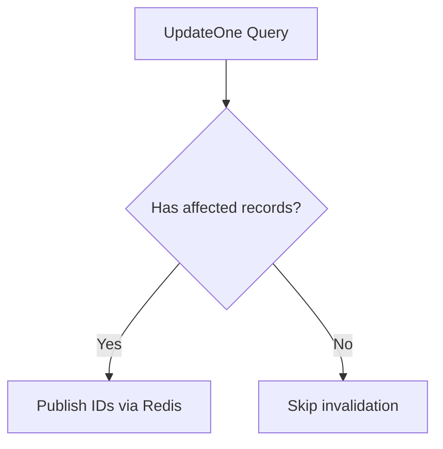
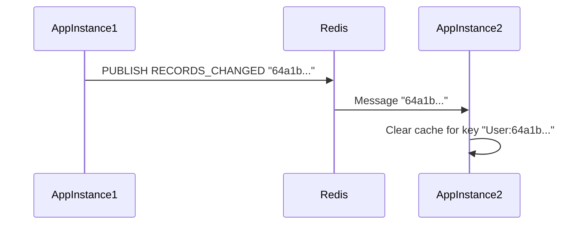

# Auto-`Invalidation` `Plugin` Guide

## Plugin Registration
```typescript
import { SpeedGooseCacheAutoCleaner } from 'speedgoose';
import mongoose from 'mongoose';

const userSchema = new mongoose.Schema({/*...*/}); 

// Register plugin with optional configuration
userSchema.plugin(SpeedGooseCacheAutoCleaner, {
  invalidateRelatedOnDelete: true // (default: true)
});
```

## `Hook` `Types` & `Triggers`

### Document Lifecycle Hooks
| Hook Type       | Trigger Actions                          | Redis Event            |
|-----------------|------------------------------------------|------------------------|
| `pre('save')`   | Document creation/update                 | RECORDS_CHANGED        |
| `post('save')`  | After document persistence               | N/A                    |
| `pre('remove')` | Document deletion                        | RECORDS_CHANGED        |

### Query Hooks


## Cache `Key` `Generation`
Keys follow pattern: `{modelName}:{recordId}`  
Multi-tenant keys: `{modelName}:{tenantId}:{recordId}`

```typescript
// From src/utils/cacheKeyUtils.ts
`${modelName}::${recordId}` // Base pattern
`${modelName}:${multitenantValue}:${recordId}` // With tenant
```

## `Redis` `Pub`/`Sub` Architecture


## Test Coverage
1. Hook timeout failures in setup/teardown (4 failed tests)  
2. Grandparent document invalidation edge cases  
3. Bulk operation performance metrics

```javascript
// Recommended test setup adjustment
jest.setTimeout(10000); // Increase from default 5000ms
```

## Performance
| Operation Type | Records | Avg. Duration | Source |
|----------------|---------|---------------|--------|
| Single update  | 1       | 2-5ms         | `invalidation.test.ts` |
| Bulk update    | 500     | <1000ms       | Line 206 |

## Failure Handling
1. Redis connection drops - falls back to local cache clear  
2. Race conditions - uses Redis transactions (MULTI/EXEC)  
3. Schema conflicts - plugin registration checks (lines 90-97)

```typescript
// Error handling example from src/plugin/utils.ts
try {
  await publishRecordIdsOnChannel(...);
} catch (err) {
  debugUtils(`Failed to publish changes, clearing locally`);
  clearHydrationCache(recordId); 
}