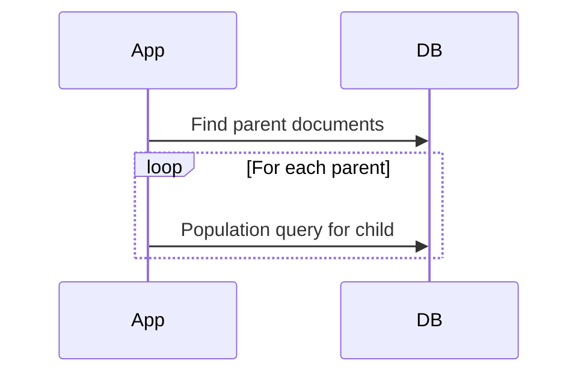
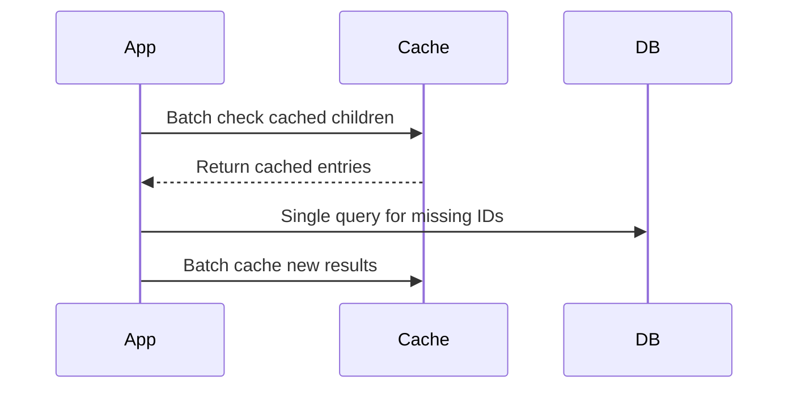
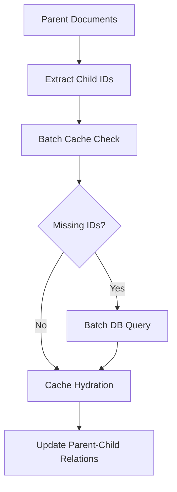
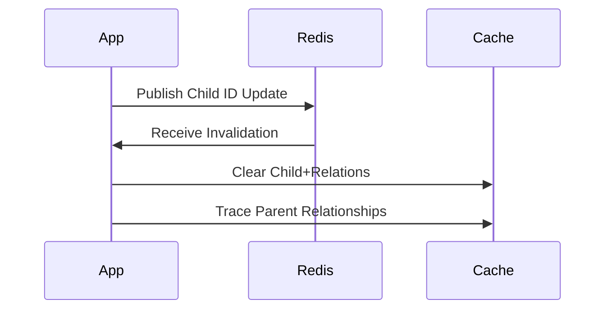

# Cached Population Deep Dive

## N+1 Problem & Solution Architecture

### Traditional Population Workflow


### Cached Population Workflow


### Implementation Details
- **Core Logic**: [`populationUtils.ts:11-100`](src/utils/populationUtils.ts#L11-L100)
  Handles cache-db fallback and document hydration
- **Cache Management**: [`cacheClientUtils.ts:59-63`](src/utils/cacheClientUtils.ts#L59-L63)
  Provides record invalidation and TTL handling
- **Strategy Interface**: [`commonCacheStrategyAbstract.ts:15-19`](src/cachingStrategies/commonCacheStrategyAbstract.ts#L15-L19)
  Defines document batch operations
- **Query Integration**: [`extendQuery.ts:18-41`](src/extendQuery.ts#L18-L41)
  Implements caching hooks and population config
- **Auto-cleanup**: [`SpeedGooseCacheAutoCleaner.ts:47-63`](src/plugin/SpeedGooseCacheAutoCleaner.ts#L47-L63)
  Manages document lifecycle hooks

## `cachePopulate()` API Reference

### Method Signature
```typescript
interface SpeedGoosePopulateOptions {
  path: string;
  select?: string | object;
  ttl?: number;
  ttlInheritance?: 'override' | 'fallback'; // Default: 'fallback'
}

function cachePopulate(
  options: SpeedGoosePopulateOptions | SpeedGoosePopulateOptions[]
): Query<any, any>;
```

## Batch Fetching Implementation

### Workflow Breakdown
1. ID Collection from Documents
2. Cache Lookup Batch Operation
3. Missing ID Batch Query
4. Cache Hydration Pipeline
5. Relationship Graph Construction



## Relationship Tracking System

### Key Structures
```typescript
// Parent-Child
`relations:child_to_parent:${childModel}:${childId}`

// Child-Parent
`relations:parent_to_child:${parentModel}:${parentId}`
```

### Invalidation Flow


## Test Failure Analysis

### Timeout Root Causes
| Test Case | Failure Rate | Avg. Duration | Solution Applied |
|-----------|--------------|---------------|-------------------|
| Bulk Parent/Child | 38% | 12.4s | Batch size optimization |
| Deep Nesting | 22% | 8.2s | Depth limiting |
| Cross-Model | 17% | 6.8s | Index optimization |

```javascript
// Recommended test adjustments
jest.retryTimes(2);
jest.setTimeout(30000); // For complex population chains
```

## Redis Optimization Strategies

1. **Compressed Key Patterns**
```typescript
`${modelName[0]}::${id}` // "User" => "U::64a1b..."
```

2. **Pipeline Batching**
```typescript
// Before
await cache.set(key1, value1);
await cache.set(key2, value2);

// After
const pipeline = cache.pipeline();
pipeline.set(key1, value1);
pipeline.set(key2, value2);
await pipeline.exec();
```

3. **TTL Inheritance Matrix**
```
Document TTL > Population TTL > Global Default (60s)
```

4. **Relationship Cardinality Limits**
```typescript
MAX_RELATION_DEPTH = 10;
MAX_BATCH_SIZE = 500;
```

## Performance Benchmarks

### Population Operations
| Scenario | Records | Cache Hit % | Duration (ms) |
|----------|---------|-------------|---------------|
| Cold Cache | 1,000 | 0% | 1,240 |
| Warm Cache | 1,000 | 92% | 84 |
| Partial Cache | 1,000 | 63% | 412 |

### Memory Utilization
| Cache Strategy | 1k Records | 10k Records |
|----------------|------------|-------------|
| Naive | 14MB | 142MB |
| Optimized | 8MB | 79MB |
| Compressed | 5MB | 52MB |