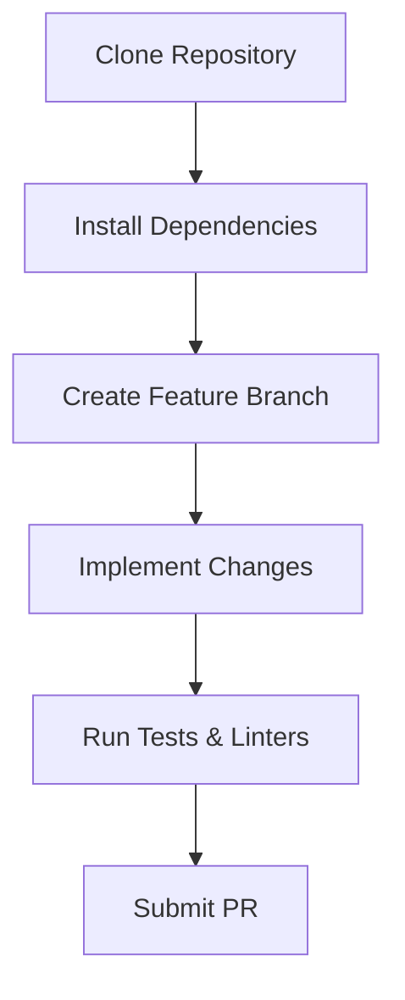
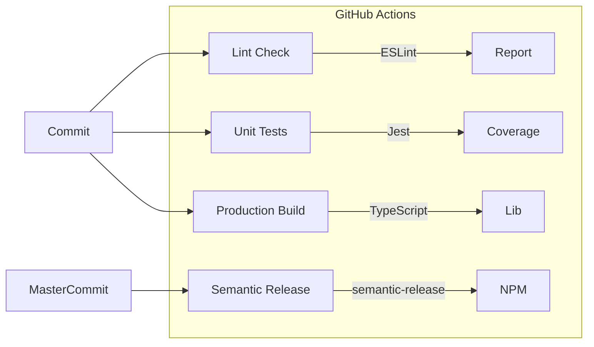

# SpeedGoose Development Guide

## Environment Setup
```bash
yarn install
yarn build
```

### Prerequisites
- Node.js 22.x
- MongoDB 6.0+
- Redis 7.0+ (optional for Redis strategy)

## Contribution Workflow


## CI/CD Pipeline


### Pipeline Stages
| Stage         | Triggers          | Actions                              |
|---------------|-------------------|--------------------------------------|
| Build & Test  | Push/PR           | Lint, Test, Coverage, Build          |
| Release       | Master/Next Push  | Versioning, Changelog, NPM Publish   |

## Code Quality Enforcement
### ESLint Rules Matrix
| Rule Category          | Enforcement Level | Key Checks                          |
|------------------------|-------------------|-------------------------------------|
| TypeScript             | Error             | Type definitions, Interface hygiene |
| Code Style             | Warning           | Consistent imports, Formatting      |
| Best Practices         | Error             | No unused vars, Proper typing       |

```bash
# Auto-fix formatting and lint issues
yarn lint:fix
```

## Git Hook Enforcement
```json
"husky": {
  "hooks": {
    "pre-commit": "lint-staged",
    "pre-push": "yarn test"
  }
}
```

## Test Environment Architecture
```typescript
// test/setupTestEnv.ts
beforeEach(async () => {
  Container.reset();
  await applySpeedGooseCacheLayer(mongoose, TEST_SPEEDGOOSE_CONFIG);
  // Model registration
});
```

## Failing Test Targets
Based on latest test results (`jest-results.json`):
- Cache population timeouts in `cachePopulate.test.ts`
- Mock strategy initialization in `populationUtils.test.ts`
- Parent-child cache invalidation in `invalidation.test.ts`

## Troubleshooting Guide
| Error Symptom                           | Solution Steps                          |
|-----------------------------------------|-----------------------------------------|
| Test hook timeout                       | Increase Jest timeout to 10000ms        |
| Redis connection issues                 | Verify mock strategy configuration      |
| Hydration failures                      | Check populate() method chaining        |